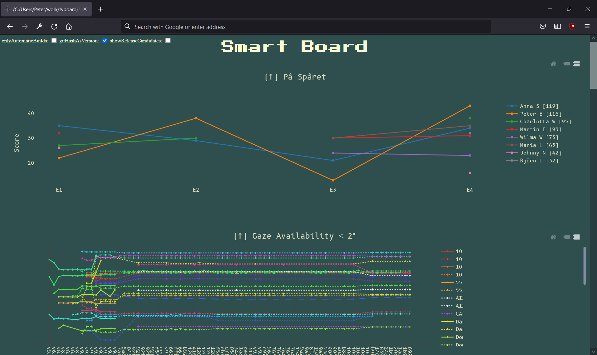

# På Spåret Proxy

The På Spåret Proxy is a simple proxy in front of the SVT Duo API, making
requests on behalf of an authenticated user.

I used this to bring a På Spåret leaderboard to my team's internal dashboard
(see image below), without each team member needing to login to an account on
their own.

The APIs used by the proxy were found by "investigating" the
[SVT Duo Android App][1] and the [På Spåret web-app][2]. These are (as far as I
could find) not officially supported, so expect this proxy to break at anytime
:grin:!

[1]: https://play.google.com/store/apps/details?id=se.svt.duo
[2]: https://applications.svt.se/pa-sparet/
